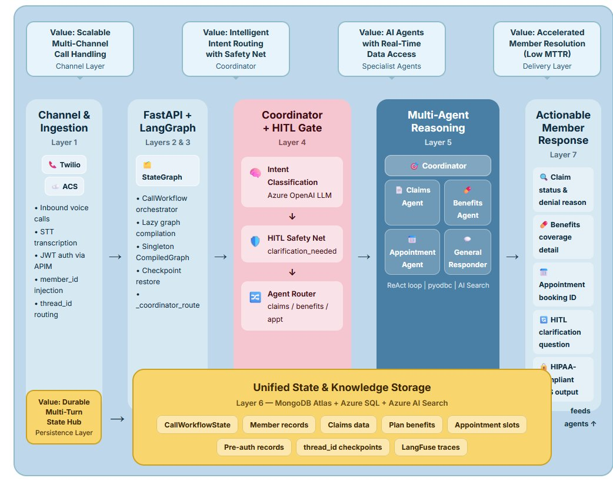
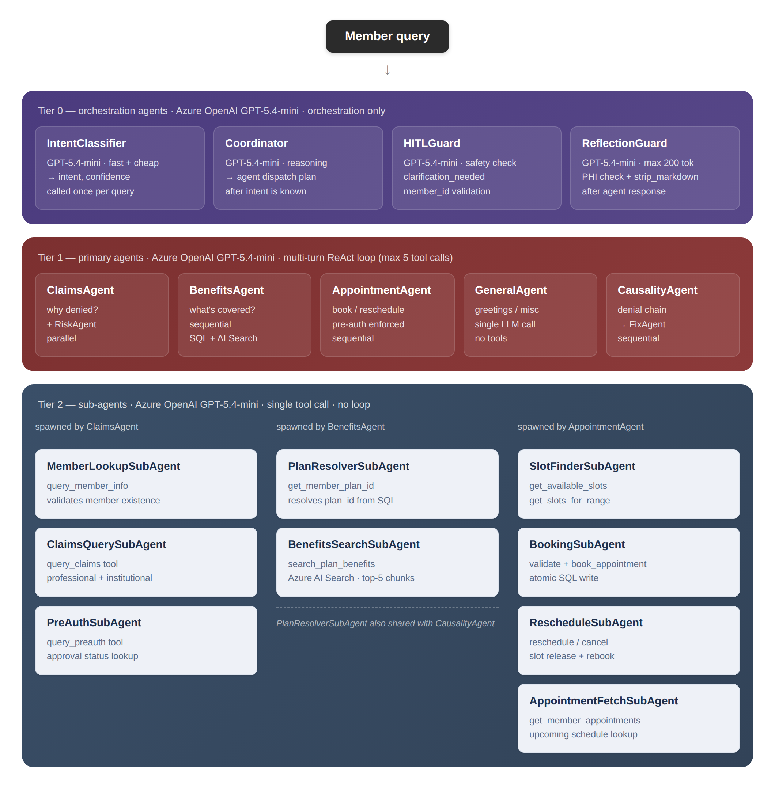
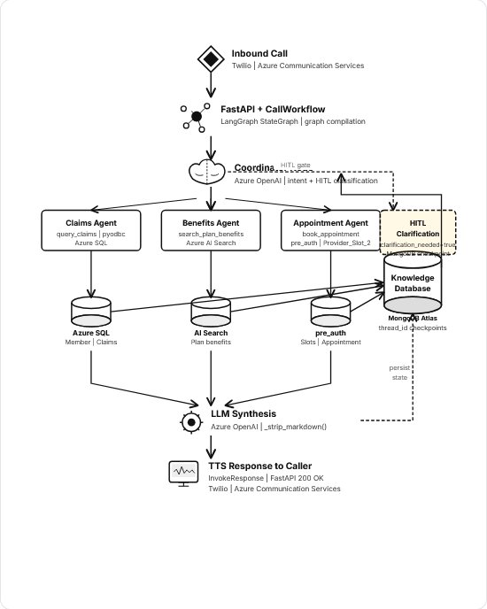

# Healthcare AI Contact Center Platform

*Solution & Technical Design Document — Agentic Call Workflow Engine — LangGraph + Azure*

`Version 1.0` `2026`

---

## Business Context { #business-context }

<!-- TODO: paste your existing content for this section here. -->

### Industry Challenges and Business Impact { #industry-challenges }

Healthcare contact centres handle millions of calls annually covering claims status, benefits enquiries, appointment scheduling, member account updates, and general assistance. Manual handling is expensive, error-prone, and creates compliance risk.

Common challenges include:

- Long Mean Time To Resolution (MTTR) for member queries
- Limited visibility across intent classification boundaries
- Difficulty correlating member requests with accurate backend data
- Dependency on senior agents and tribal knowledge for complex cases
- High operational costs associated with Tier-1 and Tier-2 interactions

These challenges impact healthcare payers, providers, and members across:

- Health Insurance and Managed Care
- Hospital Systems and Provider Networks
- Pharmacy Benefit Management
- Medicare and Medicaid Programmes
- Employer-Sponsored Health Plans

### Business Impact of Production Failures { #business-impact }

Industry studies consistently show that unautomated or poorly automated contact centre interactions result in significant operational and financial costs.

| Impact Area | Typical Business Impact |
|------------|-------------|
| Manual claim lookups | Increased agent handle time and cost-per-call |
| Missed appointment bookings | Provider revenue loss and patient dissatisfaction |
| Benefits misquotation | Member complaints, rework, and compliance risk |
| Escalations to senior agents | Higher operational costs and longer resolution times |
| HIPAA non-compliance | Regulatory penalties and reputational damage |

Automating Tier-1 and Tier-2 interactions directly reduces cost-per-contact, improves first-call resolution rates, and ensures consistent HIPAA-compliant handling of Protected Health Information (PHI).

### Client Context — Problem Statement { #problem-statement }

A healthcare contact centre team handles thousands of daily calls across claims, benefits, and appointment management. Members call with specific questions but agents must navigate multiple disconnected systems — a claims portal, a benefits document repository, an EHR scheduling system — to answer them.

The process becomes time-consuming because:

- No unified AI layer exists to classify intent and route to the correct backend.
- Multi-turn conversations lose context across HTTP requests.
- Appointment scheduling requires checking pre-authorization before booking.
- HIPAA compliance must be maintained across every interaction without exception.

In such scenarios, handling quality depends on individual agent knowledge, making it difficult to consistently and quickly serve members at scale.

### Design Inputs { #design-inputs }

The following realities of healthcare contact centre operations define the design inputs for this platform:

| System Characteristics | Operational Realities | Platform Considerations |
|------------------------|-----------------------|-------------------------|
| Multiple intent domains across a single conversation | Intent routing is manual and agent-driven | Automated LLM-based intent classification required |
| Backend data spread across SQL, search, and EHR | No unified data access layer | Agent-specific tool sets per intent domain |
| HIPAA-regulated member data in every interaction | PHI exposure risk in logs and LLM prompts | PHI masking and parameterised queries mandatory |
| Multi-turn conversations common for complex queries | Context is lost between calls | Durable MongoDB checkpointing required |

### Constraints { #constraints }

The system must operate within the following constraints:

- Handle concurrent calls across claims, benefits, appointment, and general intents.
- Never invoke a specialist agent without required member identifiers being present or requested.
- Not rely on manual intervention during live call processing.
- Maintain HIPAA compliance in all LLM prompts, logs, and stored checkpoints.
- Produce responses readable by TTS engines — no markdown, no formatting symbols.
- Complete responses within 3 seconds P95 for general intent; under 5 seconds for specialist agents.

### Platform Goals { #platform-goals }

The platform provides a structured and intelligent approach to healthcare contact automation with the following objectives:

- Automate 60–70% of Tier-1 calls with zero human agent involvement.
- Classify caller intent accurately on every turn using Azure OpenAI.
- Enforce Human-in-the-Loop (HITL) gates to ensure no member is mis-served due to missing data.
- Preserve multi-turn conversation state durably across HTTP requests using MongoDB.
- Support appointment lifecycle management with pre-authorization enforcement.
- Deliver HIPAA-aligned PHI handling across every system boundary.

With this context in place, the next step is to understand how the system approaches solving it.

### Solution Direction { #solution-direction }

To achieve these goals, the platform is designed to:

- Classify the caller's intent on every turn using a structured LLM call.
- Enrich state with member identifiers extracted from the conversation.
- Route to specialist agents that combine tool use and LLM reasoning.
- Use this combined understanding to deliver plain-English answers via TTS.

This approach transitions healthcare contact handling from a manual, agent-driven activity to a system-assisted, intelligence-driven process.

## Architecture { #architecture }

### Solution Options { #solution-options }

Multiple approaches were evaluated for automating healthcare contact centre interactions.

**Rule-Based IVR Systems**

These rely on fixed decision trees and touch-tone menus, making them unsuitable for natural language queries and multi-intent conversations.

**Single LLM Chatbots**

While flexible, they lack structured tool use, do not enforce HITL safety nets, and cannot maintain durable multi-turn state.

**Monitoring and Observability Platforms**

These provide call analytics but do not reason over backend data or classify healthcare-specific intents.

**Agentic Multi-Agent Architecture (Recommended)**

- Combines structured intent classification with specialist agent tool use.
- Bridges the gap between natural language and backend data systems.
- Best fit for multi-intent, multi-turn, HIPAA-compliant healthcare automation.

### Competitive Differentiation { #competitive-differentiation }

The healthcare AI contact centre market includes a range of offerings — from generic large-language-model chatbots to legacy interactive voice response systems and call analytics dashboards. While each addresses a narrow slice of the problem, none combines healthcare-domain intelligence, durable multi-turn state, live backend integration, and built-in compliance enforcement in a single cohesive platform. The table below maps the five most meaningful differentiators across solution categories.

| Differentiator | Rule-Based IVR | Generic LLM Chatbot | Analytics / Observability Platform | This Platform |
|----------------|----------------|---------------------|------------------------------------|---------------|
| Healthcare-Domain Specificity | Scripted responses only; no HIPAA enforcement by design | General-purpose; PHI handling and pre-auth logic must be custom-built and maintained separately | Reads call data; does not act on it or enforce compliance | HIPAA-aligned PHI masking, parameterised queries, and pre-authorisation enforcement built into every agent and tool |
| Multi-Agent Orchestration | Single decision tree; no agent composition | Single LLM call per turn; no structured routing to specialist logic | Not applicable — passive observation only | LangGraph StateGraph with coordinator node routing to dedicated specialist agents (Claims, Benefits, Appointment, General) per classified intent |
| Durable Multi-Turn State | Stateless between DTMF inputs; no conversation memory | Typically session-scoped; state lost on disconnect or timeout | Stores transcripts but does not carry live state across turns | MongoDB checkpointing persists full `CallWorkflowState` across HTTP requests, enabling seamless multi-turn resumption and audit replay |
| Live Backend Integration via Tool Use | Reads from a single static script; no real-time data access | RAG retrieval from static documents; no transactional write capability | Read-only analytics on historical data | ReAct agents invoke typed tools against Azure SQL (claims, appointments), Azure AI Search (benefits), and EHR systems in real time — including transactional writes such as booking and cancellation |
| Human-in-the-Loop (HITL) Safety Gates | Escalates on unrecognised input only; no structured safety net | HITL, if present, is a post-hoc add-on requiring custom prompt engineering per use case | Flags calls after the fact; cannot intervene during live handling | HITL is a first-class graph node: the coordinator pauses execution and requests missing identifiers before any specialist agent is invoked, preventing member mis-service by design |

**Healthcare-Domain Specificity**

Generic AI platforms require extensive custom development to handle healthcare-specific requirements such as PHI masking, pre-authorisation enforcement, and HIPAA-compliant audit logging. This platform encodes those requirements directly into its agent prompts, tool implementations, and state schema — meaning compliance is structural, not a layer applied after the fact. Every LLM prompt is designed to avoid logging raw member data, and every SQL tool uses parameterised queries to prevent injection and inadvertent PHI exposure.

**Orchestrated Multi-Agent Reasoning vs. Single-Model Approaches**

Single LLM chatbots handle all intents within one prompt context, which degrades accuracy as conversation complexity grows and makes it difficult to enforce intent-specific data access boundaries. This platform separates concerns explicitly: the coordinator performs one focused structured classification call, and each specialist agent operates within a scoped tool set appropriate to its domain. This means a benefits query never has access to appointment booking tools, and vice versa — reducing both error surface and compliance risk.

**Transactional Tool Use vs. Retrieval-Only Architectures**

Most RAG-based healthcare bots retrieve content from static benefit documents and surface it as text. This platform goes further: specialist agents read and write to live backend systems. The AppointmentSchedulerAgent, for example, validates pre-authorisation, checks real-time slot availability, atomically books the appointment, and updates the provider slot record — all within a single ReAct agent loop. This closes the loop between natural language and operational outcome without requiring a human agent to execute the backend steps.

### Output Benchmarks { #output-benchmarks }

The following benchmarks define the measurable performance envelope the platform is designed to operate within. Metrics are classified as Target (design goal, to be validated post-deployment) or Measured (empirically confirmed). Formal instrumentation for all metrics is planned via LangFuse dashboards as part of the near-term roadmap.

| Metric | Benchmark | Status | Source / Rationale |
|--------|-----------|--------|--------------------|
| Response Latency — General Intent | P95 ≤ 3 seconds end-to-end | Target | Defined in system constraints. General intent requires a single coordinator LLM call with no specialist agent invocation. |
| Response Latency — Specialist Agents | P95 ≤ 5 seconds end-to-end | Target | Defined in system constraints. Includes coordinator classification, ReAct agent tool calls against Azure SQL / Azure AI Search, and TTS-ready response assembly. |
| Tier-1 Call Automation Rate | 60–70% of inbound Tier-1 calls fully automated with zero human agent involvement | Target | Platform goal. Covers claims status, benefit lookups, and standard appointment booking scenarios that do not require clinical judgement or exception handling. |
| Intent Classification Accuracy | ≥ 95% correct intent classification across claims, benefits, appointment, and general intents | Target | Derived from coordinator design using structured JSON output via Azure OpenAI. To be validated against a labelled call transcript evaluation set via LangFuse prompt versioning. |
| Appointment Booking Handle Time | ≤ 30 seconds for standard pre-authorised booking scenarios | Target | Referenced in the Example Appointment Booking Flow. Compared against a baseline of several minutes for manual agent-driven cross-system booking. |
| HITL Escalation Rate | ≤ 15% of calls requiring human-in-the-loop intervention for missing identifiers or unresolvable intents | Target | HITL is a safety net, not a routine path. Escalation rate above 20% would indicate degraded member experience or upstream identifier-injection failures from the channel layer. |
| Cost per Query | To be baselined post-deployment | Target | LangFuse token-usage tracing per intent will enable cost-per-query reporting. Coordinator uses gpt-4o-mini to minimise cost on high-frequency classification calls. |
| LangGraph Graph Compilation Overhead | One-time cost on first request; ≤ 0 ms on all subsequent requests (singleton cache) | Target | Lazy compilation with singleton `CompiledGraph` cache eliminates per-request assembly cost. Cold-start compilation is borne once per service instance lifecycle. |
| State Checkpoint Restore Latency | ≤ 50 ms for MongoDB checkpoint retrieval on returning calls | Target | MongoDB `langgraph_checkpoints` collection indexed on `thread_id`. In-memory `MemorySaver` fallback used when MongoDB is unavailable, with sub-millisecond restore. |

**Benchmark Monitoring Strategy**

Once deployed, all latency, accuracy, and cost benchmarks will be tracked through LangFuse distributed traces. Each graph invocation emits a trace covering the coordinator LLM call, any specialist agent ReAct loop iterations, individual tool call durations, and the final response assembly step. Per-intent dashboards will surface HITL rate trends over time, allowing the team to tune intent prompts and HITL thresholds based on real traffic patterns rather than design assumptions.

Prompt versioning via LangFuse will support A/B evaluation of `INTENT_PROMPT` and `GENERAL_PROMPT` variants, enabling data-driven improvement of classification accuracy without requiring full redeployment cycles. Cost-per-query reporting will be broken down by intent domain to identify optimisation opportunities — for example, replacing the coordinator model with a fine-tuned smaller model once sufficient training data is available, as noted in the long-term roadmap.

### High-Level Architecture { #high-level-architecture }

The platform follows a layered architecture pattern. An inbound HTTP request from the voice/channel integration layer hits the FastAPI service, which delegates to the `CallWorkflow` orchestrator. `CallWorkflow` compiles and caches the LangGraph `StateGraph`, then invokes it with the caller's question and context. The graph routes through the coordinator and selected specialist agent, then returns a structured `InvokeResponse` to the API caller.

### High-Level Platform Workflow { #high-level-platform-workflow }

The diagram below shows how the seven layers of the platform interact — from channel ingestion through multi-agent reasoning to member response delivery, underpinned by a unified state and knowledge storage layer.

{ .diagram }

### Runtime Architecture { #runtime-architecture }

The platform is organised into three logical tiers. Tier 0 handles orchestration — classifying intent, planning agent dispatch, enforcing HITL safety, and validating outputs before delivery. Tier 1 runs the primary specialist agents in ReAct tool-use loops. Tier 2 provides lightweight single-call sub-agents spawned by Tier 1 for focused data retrieval tasks.

{ .diagram }

### Graph Nodes { #graph-nodes }

The graph topology is a one-shot decision tree: every invocation enters at `__start__`, passes through the coordinator, and terminates at `__end__`. There are no cycles except the internal ReAct tool-use loop inside specialist agent sub-graphs.

| Node | Type | Responsibility |
|------|------|----------------|
| `__start__` | Virtual | LangGraph entry point. Injects initial `CallWorkflowState`. |
| `coordinator` | Custom Node | Classifies intent via LLM. Extracts `member_id`, `plan_id`, `date_of_service`. Sets `clarification_needed` flag. |
| `claims_agent` | Agent Node | Invokes `ClaimsAgent.ainvoke()`. Executes ReAct loop with `query_member_info`, `query_claims`, `query_preauth` tools against Azure SQL. |
| `benefits_agent` | Agent Node | Invokes `BenefitsAgent.ainvoke()`. Executes ReAct loop with `get_member_plan_id` (Azure SQL) and `search_plan_benefits` (Azure AI Search). |
| `appointment_agent` | Agent Node | Invokes `AppointmentSchedulerAgent.ainvoke()`. Executes ReAct loop with 8 tools against Azure SQL (`Provider_Slot_2`, `Appointment`, `pre_auth` tables). |
| `general_responder` | Custom Node | Single LLM call with `GENERAL_PROMPT` system message. Returns 1-2 sentence plain-English reply. |
| `__end__` | Virtual | LangGraph terminal node. Graph suspends here and returns final state to `CallWorkflow.invoke()`. |

### Graph Edges { #graph-edges }

| Edge | Condition |
|------|-----------|
| `START → coordinator` | Unconditional. Every invocation enters coordinator first. |
| `coordinator → claims_agent` | Conditional. Fires when intent = 'claims' AND `clarification_needed` = false. |
| `coordinator → benefits_agent` | Conditional. Fires when intent = 'benefits' AND `clarification_needed` = false. |
| `coordinator → appointment_agent` | Conditional. Fires when intent = 'appointment' AND `clarification_needed` = false. |
| `coordinator → general_responder` | Conditional. Fires when intent = 'general' or 'default' AND `clarification_needed` = false. |
| `coordinator → __end__` | Conditional. Fires when `clarification_needed` = true. Graph terminates early; clarification question returned to caller. |
| `claims_agent → __end__` | Unconditional. Agent completes and graph terminates. |
| `benefits_agent → __end__` | Unconditional. Agent completes and graph terminates. |
| `appointment_agent → __end__` | Unconditional. Agent completes and graph terminates. |
| `general_responder → __end__` | Unconditional. Responder completes and graph terminates. |

### Graph Compilation and Startup { #compilation-startup }

Graph compilation is an expensive one-time operation. `CallWorkflow` implements a lazy singleton pattern: the first call to `compile()` performs full graph assembly; subsequent calls return the cached `_compiled_graph` instance.

1. FastAPI startup fires — calls `CallWorkflow.compile()`.
2. `CallWorkflow` checks `_compiled_graph`; if already compiled, returns immediately (fast path).
3. On first compile: `_get_checkpointer()` initialises the persistence backend.
4. `MongoClient` is created with `MONGODB_URL` and a 5-second connection timeout.
5. If connection succeeds: `MongoDBSaver` is instantiated targeting `directline_db` database.
6. If connection times out: `MemorySaver` is used as in-process fallback.
7. Five nodes added: `coordinator`, `claims_agent`, `benefits_agent`, `appointment_agent`, `general_responder`.
8. `graph.compile(checkpointer=checkpointer)` produces the `CompiledGraph`.
9. `CompiledGraph` cached to `_compiled_graph` and returned to FastAPI startup.

## Workflow { #workflow }

### End-to-End Workflow Diagram { #e2e-workflow-diagram }

The platform processes every inbound call through a seven-step pipeline — from channel ingestion through intent classification, specialist agent tool use, data retrieval, LLM synthesis, and durable checkpoint persistence — before delivering a plain-English TTS response to the caller.

{ .diagram }

### Step 1 — Inbound Call { #workflow-step1 }

Every interaction begins when a member call arrives via Twilio or Azure Communication Services. The channel layer converts the audio stream to text and forwards the utterance to the FastAPI endpoint as a structured JSON payload.

### Step 2 — FastAPI + CallWorkflow { #workflow-step2 }

The FastAPI service validates the JWT and delegates to the `CallWorkflow` orchestrator. On the first request, the LangGraph `StateGraph` is compiled and cached. If a `thread_id` is provided, the prior checkpoint is restored from MongoDB Atlas before any node executes.

### Step 3 — Coordinator Node { #workflow-step3 }

A single structured Azure OpenAI call classifies the caller's intent and extracts identifiers (`member_id`, `plan_id`, `date_of_service`). A Python safety net then inspects the result — if intent is claims and `member_id` is absent, `clarification_needed` is forced to true regardless of LLM output, triggering the HITL gate.

### Step 4 — Specialist Agent Routing { #workflow-step4 }

The coordinator routes to one of four paths based on classified intent:

- **Claims agent** — ReAct loop against Azure SQL (`Claims_Professional`, `Claims_Institutional`, `Member` tables).
- **Benefits agent** — hybrid ReAct loop combining Azure SQL plan lookup with Azure AI Search semantic retrieval.
- **Appointment agent** — eight-tool ReAct loop against `Provider_Slot_2`, `Appointment`, and `pre_auth` tables.
- **General responder** — single LLM call, no tool use, lowest latency path.
- **HITL gate** — graph terminates early, clarification question returned to caller, full state checkpointed to MongoDB.

### Step 5 — Data Layer { #workflow-step5 }

Each specialist agent issues parameterised queries to its designated backend. All Azure SQL access uses `pyodbc` wrapped in `run_in_executor` for async compatibility. Azure AI Search applies a `plan_id` filter on every search to prevent cross-plan data leakage.

### Step 6 — LLM Synthesis { #workflow-step6 }

Tool results are passed back to the agent's LLM, which synthesises a plain-English response. `_strip_markdown()` is applied to ensure TTS readability. The complete `CallWorkflowState` is then persisted to MongoDB Atlas under the caller's `thread_id`.

### Step 7 — TTS Response { #workflow-step7 }

The `InvokeResponse` object is serialised to JSON and returned as HTTP 200 OK. The channel layer converts the `answer` field to speech via the TTS engine. The `thread_id` is passed back to the caller for use in subsequent turns.

## State Schema Design { #state-schema }

All data flowing through the graph is carried in a single Pydantic `TypedDict` subclass, `CallWorkflowState`. LangGraph merges partial state updates returned by each node into the running state object. No node receives anything except state — there are no side channels or global variables.

### CallWorkflowState { #callworkflowstate }

| Field | Type | Purpose |
|-------|------|---------|
| `messages` | `list[BaseMessage]` | Append-only conversation history. Uses `add_messages` reducer. Every node appends its `AIMessage` output. |
| `member_id` | `Optional[str]` | Healthcare member identifier extracted by coordinator. Required for claims and benefits intents. |
| `plan_id` | `Optional[str]` | Insurance plan identifier. Resolved by BenefitsAgent via `get_member_plan_id` tool. |
| `date_of_service` | `Optional[str]` | Service date string. Used by ClaimsAgent to filter claim results. |
| `intent` | `Optional[str]` | Classified intent: 'claims', 'benefits', 'appointment', 'general', or 'default'. Set by coordinator LLM call. |
| `clarification_needed` | `bool` | True when intent requires `member_id` but none was provided. Triggers HITL pause. |
| `clarification_question` | `Optional[str]` | Natural-language question to return to the caller when `clarification_needed` is True. |
| `agent_response` | `Optional[str]` | Final plain-English answer. `_strip_markdown()` applied before storage. |
| `thread_id` | `str` | UUID identifying the conversation thread. LangGraph checkpoint config key. |
| `metadata` | `Dict[str, Any]` | LangFuse trace IDs, channel identifiers, and operator-defined tags. |

### CoordinatorOutput { #coordinatoroutput }

`CoordinatorOutput` is a Pydantic `BaseModel` used as the structured output schema for the coordinator LLM call. Azure OpenAI is instructed to return JSON conforming to this schema.

| Field | Description |
|-------|-------------|
| `intent` | str — Classified intent. One of: claims, benefits, appointment, general, default. |
| `member_id` | str \| null — Member ID extracted from utterance, or null if absent. |
| `plan_id` | str \| null — Plan ID if mentioned, or null. |
| `date_of_service` | str \| null — Date of service if mentioned, or null. |
| `clarification_needed` | bool — True if required data absent from utterance and state. |
| `clarification_question` | str \| null — Question to ask the caller when `clarification_needed` is True. |

### InvokeResponse { #invokeresponse }

`InvokeResponse` is assembled by `CallWorkflow.invoke()` from the final `CallWorkflowState` once the graph terminates. It is serialised to JSON and returned to the FastAPI route handler.

| Field | Description |
|-------|-------------|
| `answer` | str — The `agent_response` or `clarification_question`. This is what the TTS engine speaks to the caller. |
| `thread_id` | str — The thread UUID. Must be passed back by the client on the next turn. |
| `intent` | str \| null — The classified intent from this turn. |
| `clarification_needed` | bool — True if this response is a clarification request. |
| `clarification_question` | str \| null — The clarification question text if applicable. |
| `metadata` | dict — Pass-through of `state.metadata`, enriched with LangFuse trace data. |

## Component Design { #component-design }

### Coordinator Node { #coordinator-node }

#### Responsibilities { #coordinator-responsibilities }

- Issue a single structured LLM call (Azure OpenAI) with the full conversation history and an intent classification prompt.
- Parse the `CoordinatorOutput` JSON response and merge extracted fields into `CallWorkflowState`.
- Apply a safety net: if `intent == 'claims'` and `member_id` is absent, force `clarification_needed = True` regardless of LLM output.
- Return the updated state slice — LangGraph merges it into the running state.

#### LLM Call Details { #coordinator-llm }

| Property | Value |
|----------|-------|
| Model | Azure OpenAI (`AZURE_OPENAI_ENDPOINT` + `OPENAI_API_KEY`) |
| Prompt | `INTENT_PROMPT` system message + full `messages` history + injected variables: `message`, `history_summary`, `member_id`, `plan_id`, `date_of_service` |
| Output Format | Structured JSON conforming to `CoordinatorOutput` schema. Enforced via function calling / JSON mode. |
| Context Window | Full `messages` list passed. `history_summary` compresses prior context for long conversations. |
| Safety Net | Post-LLM Python check: `intent='claims'` AND `member_id=None` → override `clarification_needed=True` |

### Claims Agent { #claims-agent }

ClaimsAgent is a LangChain ReAct agent with three Azure SQL tools. It runs an autonomous tool-use loop: it selects tools, inspects results, and continues until it has enough information to formulate a complete plain-English answer.

#### Tools { #claims-tools }

| Tool | Backend | Description |
|------|---------|-------------|
| `query_member_info` | Azure SQL | `SELECT * FROM Member WHERE Member_ID=?` Returns member demographics JSON. Called first to validate member existence. |
| `query_claims` | Azure SQL | `SELECT` from `Claims_Professional` + `Claims_Institutional` filtered by `member_id` and optional `date_from`. Returns list of claims (max 20 records). |
| `query_preauth` | Azure SQL | `SELECT` preauthorisation records for member. Called when caller asks about pending approvals or preauth status. |

#### Context Enrichment { #claims-context }

Before entering the ReAct loop, the claims agent node prepends a context message to the `messages` list: `{Context: member_id, date_of_service}`. This ensures the LLM inside ClaimsAgent always has these identifiers available without re-parsing the conversation history.

#### Database Connectivity { #claims-db }

| Property | Value |
|----------|-------|
| Driver | `pyodbc` with SQL Server ODBC driver. Connection pooling managed at application level. |
| Connection | Parameterised via `AZURE_SQL_CONNECTION_STRING` environment variable. |
| Execution | `run_in_executor` wraps synchronous `pyodbc` calls for async compatibility with LangGraph's asyncio loop. |
| Security | All queries use parameterised placeholders (`?`). No string interpolation. Principle of least privilege on the DB service account. |

### Benefits Agent { #benefits-agent }

BenefitsAgent is a LangChain ReAct agent with two tools covering Azure SQL for plan metadata and Azure AI Search for benefit document retrieval. This hybrid approach ensures both structured plan data and unstructured benefit content are available to the LLM.

#### Tools { #benefits-tools }

| Tool | Backend | Description |
|------|---------|-------------|
| `get_member_plan_id` | Azure SQL | `SELECT Plan_ID, Plan_Type, Line_of_Business FROM Member WHERE Member_ID=?` Resolves the member's active plan. |
| `search_plan_benefits` | Azure AI Search | Semantic or keyword search over the plan benefits corpus. Filtered by `plan_id`. Returns top-5 benefit document chunks with relevance scores. |

#### Search Index Configuration { #benefits-search }

| Property | Value |
|----------|-------|
| Index Name | Configured via `AZURE_SEARCH_INDEX_NAME` environment variable. |
| Search Type | Hybrid (keyword + vector semantic re-rank) for maximum recall on natural-language benefit queries. |
| Filter | `plan_id` filter applied on every search to prevent cross-plan data leakage. |
| Result Count | Top-5 chunks returned. Each chunk carries content text and relevance score. |

### Appointment Scheduler Agent { #appointment-agent }

AppointmentSchedulerAgent is a LangChain ReAct agent with eight specialised tools covering appointment lifecycle management. It enables members to view, book, reschedule, and cancel appointments while respecting pre-authorization constraints and provider availability windows.

The agent handles:

- **Availability queries** — search by date, date range, provider, or time-of-day preference.
- **Booking operations** — create appointments with authorization validation and one-active-appointment-per-member enforcement.
- **Modifications** — reschedule or cancel existing appointments with atomic slot updates.
- **Smart suggestions** — recommend alternatives when requested slots are unavailable.

#### Tools { #appt-tools }

| Tool | Backend | Description |
|------|---------|-------------|
| `get_available_slots` | `Provider_Slot_2` | Fetch available slots for a date, filtered by `provider_name` and `time_of_day`. Returns up to 20 slots. |
| `validate_appointment_slot` | `Provider_Slot_2` | Verify a specific date+time slot is available before booking. Returns `slot_id`, provider info, availability status. |
| `book_appointment` | `Appointment` + `Provider_Slot_2` | Create `Appointment` record + set `Is_Booked=1`. Validates pre-auth. Enforces one-active-appointment constraint. Returns `appointment_id` or alternatives. |
| `reschedule_appointment` | `Appointment` + `Provider_Slot_2` | Atomically release old slot, book new slot, update `Appointment` record. Validates new availability before committing. |
| `cancel_appointment` | `Appointment` + `Provider_Slot_2` | Set `Appointment.Status='Cancelled'` and release `Provider_Slot_2.Is_Booked=0`. Frees slot for future bookings. |
| `get_slots_for_range` | `Provider_Slot_2` | Fetch available slots across a date range. Supports 'next 5 days', 'this week', date range expressions. |
| `get_earliest_available_slot` | `Provider_Slot_2` | Find single earliest available slot from today or a given start date. |
| `get_member_appointments` | `Appointment` | Retrieve all upcoming scheduled appointments for a member with full details. |

#### Database Schema { #appt-schema }

**`Provider_Slot_2` Table** — Available appointment slots

| Column | Type | Purpose |
|--------|------|---------|
| `Slot_ID` | UUID | Primary key. Unique slot identifier. |
| `Provider_Name` | VARCHAR(255) | Matched against `pre_auth.Provider_Name`. |
| `Date` | DATETIME | Queried with `CAST(Date AS DATE)` for comparison. |
| `Start_Time` | VARCHAR(10) | 12-hour format e.g. '06:00 PM'. Filtered by `time_of_day` range. |
| `Is_Booked` | BIT | 0=available, 1=booked, NULL=available. Updated atomically by book/cancel tools. |
| `Appointment_ID` | VARCHAR(20) | NULL if unbooked. Set by `book_appointment`. |

**`Appointment` Table** — Booked member appointments

| Column | Type | Purpose |
|--------|------|---------|
| `Appointment_ID` | VARCHAR(20) | Primary key e.g. 'APTU1A2B3C4D5'. Returned as booking confirmation. |
| `Member_ID` | VARCHAR(20) | Foreign key to `Member` table. |
| `Status` | VARCHAR(20) | Scheduled or Cancelled. |
| `Appointment_booking_timestamp` | FLOAT | Unix timestamp. Audit trail for HIPAA compliance. |

**`pre_auth` Table** — Pre-authorization constraints

| Column | Purpose |
|--------|---------|
| `Member_ID` | Constrains which provider a member may book with. |
| `Provider_Name` | Authorized provider. Matched against `Provider_Slot_2.Provider_Name`. |
| `Status` | Approved / In Review = booking permitted. Expired = blocked. |

#### Natural Language Support { #appt-nl }

The appointment tools parse natural-language date and time expressions before issuing SQL queries. All parsing is performed client-side to prevent injection.

| Input Type | Examples |
|------------|----------|
| Keywords | 'today', 'tomorrow', 'next Monday', 'this weekend', 'end of month' |
| Explicit dates | '29 June 2026', '2026-06-29', '6/29/2026' |
| Date ranges | 'next 5 days', 'this week', 'between June 1 and June 5' |
| Time periods | 'morning' (06:00–11:59), 'afternoon' (12:00–16:59), 'evening' (17:00–20:59) |
| Explicit times | '6 PM', '18:00', '6:00 PM' — normalised via `_format_time()` |

### General Responder { #general-responder }

The general responder handles all non-claims, non-benefits, non-appointment intents. It makes a single LLM call — no tool use — and is optimised for low latency and concise output.

| Property | Value |
|----------|-------|
| LLM Call | Single `ainvoke()` with `GENERAL_PROMPT` system message. |
| Variables | `message` (current utterance), `history_summary` (compressed prior turns). |
| Output Format | Plain English. 1-2 sentences maximum. No markdown. `_strip_markdown()` applied post-generation. |
| Intent Routing | Receives all `intent='general'` and `intent='default'` traffic from coordinator. |
| No HITL Gate | General intent never triggers `clarification_needed`. No member identifiers required. |

## Human-in-the-Loop (HITL) { #hitl-design }

HITL in this system refers to the pattern where the AI workflow pauses mid-execution to request additional information from the human caller. It is not a human agent takeover — it is a structured clarification request that allows the graph to resume with complete data on the next conversational turn.

### Trigger Conditions { #hitl-triggers }

| Trigger | Description |
|---------|-------------|
| Missing `member_id` for claims intent | Coordinator classifies `intent='claims'` but `member_id` is absent from both the current utterance and existing state. Safety net forces `clarification_needed=True`. |
| LLM-detected ambiguity | Coordinator LLM may set `clarification_needed=True` with a specific question for any intent where key data cannot be inferred. |

### Turn-by-Turn Flow { #hitl-flow }

#### Turn 1 — Missing Information { #hitl-turn1 }

1. Caller sends `POST /workflows/call_workflow` with question: 'What is my claim status?' — no `member_id` provided.
2. `CallWorkflow.invoke()` calls `compile()` → retrieves/builds `CompiledGraph`.
3. LangGraph `ainvoke(initial_state)` — coordinator node fires.
4. LLM returns `CoordinatorOutput`: `{intent:'claims', member_id:null, clarification_needed:true, clarification_question:'Could you provide your Member ID?'}`.
5. Python safety net confirms: `intent=claims` and `member_id=None` → `clarification_needed` forced True.
6. `_coordinator_route` returns `'__end__'`. Graph terminates early — no specialist agent is invoked.
7. LangGraph saves checkpoint to MongoDB with the generated `thread_id`.
8. `CallWorkflow` assembles `InvokeResponse`: `answer='Could you provide your Member ID?'`, `clarification_needed=True`, `thread_id='uuid-xyz'`.
9. FastAPI returns 200 OK. TTS speaks clarification question to caller.

#### Turn 2 — Data Provided { #hitl-turn2 }

1. Caller sends `POST /workflows/call_workflow` with question: 'My ID is M123', `thread_id: 'uuid-xyz'`.
2. LangGraph restores prior checkpoint for `thread_id='uuid-xyz'` — full message history intact.
3. Coordinator re-fires with enriched state (`member_id='M123'` now present in messages).
4. LLM returns: `{intent:'claims', member_id:'M123', clarification_needed:false}`.
5. Safety net passes — `member_id` is present. `_coordinator_route` returns `'claims_agent'`.
6. ClaimsAgent executes ReAct loop, queries Azure SQL, returns claim status.
7. Graph terminates normally. Full `InvokeResponse` returned. `thread_id` preserved for further turns.

### State Preservation { #hitl-state }

!!! info "Checkpoint Architecture"
    The `MongoDBSaver` stores a full serialised snapshot of `CallWorkflowState` (including all messages) keyed by `thread_id`. When LangGraph resumes with the same `thread_id`, it deserialises the prior state before invoking any node. This means the coordinator on Turn 2 sees the complete conversation history from Turn 1 — enabling coherent multi-turn reasoning without any client-side state management.

## Persistence and Checkpointing { #persistence }

### MongoDB Checkpointer { #mongodb-checkpointer }

The `MongoDBSaver` is the primary persistence backend, providing durable cross-request state for all HITL scenarios and multi-turn conversations.

| Property | Value | Notes |
|----------|-------|-------|
| Database | `directline_db` | Dedicated database for call workflow state. |
| Collection 1 | `langgraph_checkpoints` | Stores complete serialised `CallWorkflowState` snapshot per `thread_id` and checkpoint version. |
| Collection 2 | `langgraph_checkpoint_writes` | Stores incremental write operations between full checkpoints. Enables efficient partial state recovery. |
| Connection Timeout | 5 seconds | `MongoClient` constructor timeout. Prevents startup blocking on unavailable MongoDB. |
| Connection String | `MONGODB_URL` env var | Injected at runtime. Supports MongoDB Atlas or self-hosted deployments. |

### MemorySaver Fallback { #memorysaver }

If `MongoClient` fails to connect within 5 seconds, `CallWorkflow` falls back to LangGraph's built-in `MemorySaver`. `MemorySaver` stores checkpoints in process memory — state is not durable across application restarts, but the service continues to function for single-session interactions.

### Thread ID Management { #thread-id }

The `thread_id` is a UUID generated on the first invocation of a new conversation. It is:

- Returned to the caller in every `InvokeResponse`.
- Passed back by the client in subsequent requests to the same conversation.
- Used as the LangGraph config key (`config={'configurable': {'thread_id': thread_id}}`) to select the correct checkpoint.
- Scoped to a single member contact session — a new call generates a new `thread_id`.

## Intent Flow Walkthroughs { #walkthroughs }

### General Intent — Greeting { #walk-general }

This is the simplest and fastest path through the graph. It demonstrates the baseline routing logic.

1. **Client invokes with question: "Hello, how can you help me?"**
    - *LangGraph `ainvoke(initial_state)` triggered.*
2. **LLM classifies `{intent:'general', clarification_needed:false}`**
    - *`_coordinator_route` evaluates → returns `'general_responder'`.*
3. **Single LLM call with `GENERAL_PROMPT` — 1-2 sentence reply**
    - *`_strip_markdown(answer)` called. No tools, no database queries.*
4. **`InvokeResponse` assembled and returned to caller**
    - *Lowest latency path in the graph. No HITL gate required.*

### Benefits Intent — Coverage Enquiry { #walk-benefits }

Example: Caller asks 'Is acupuncture covered?' with `member_id='M456'` pre-populated.

1. **Coordinator LLM: `{intent:'benefits', member_id:'M456', clarification_needed:false}`**
    - *`_coordinator_route` → `'benefits_agent'`.*
2. **ReAct iteration 1: `get_member_plan_id` → Azure SQL**
    - *Returns `{plan_id:'PLN-001', plan_type:'PPO', ...}`.*
3. **ReAct iteration 2: `search_plan_benefits` → Azure AI Search**
    - *Filter `plan_id='PLN-001'` → returns top-5 benefit chunks with relevance scores.*
4. **LLM synthesises plain-English answer. State updated. 200 OK.**

### Claims Intent — Happy Path { #walk-claims }

Example: Caller provides `member_id='M123'` upfront. Intent classified as claims. All required data present — no HITL required.

1. **`POST /workflows/call_workflow` with question, `member_id='M123'`, `thread_id`**
    - *`compile()` called — first call only: `MongoDBSaver` connected, `StateGraph` assembled, compiled, cached.*
2. **Coordinator LLM: `{intent:'claims', member_id:'M123', clarification_needed:false}`**
    - *Safety net passes. `_coordinator_route` returns `'claims_agent'`.*
3. **ReAct: `query_member_info` → Azure SQL: `SELECT * FROM Member WHERE Member_ID=?`**
4. **ReAct: `query_claims` → `Claims_Professional` + `Claims_Institutional` (max 20 records)**
5. **LLM synthesises plain-English answer. MongoDB checkpoint saved.**
    - *FastAPI returns 200 OK with `{answer, thread_id, intent:'claims', clarification_needed:false}`.*

### Appointment Intent — Booking { #walk-appointment }

Example: Caller asks 'I'd like to book an appointment for next Tuesday afternoon.' with `member_id='M456'`.

1. **Coordinator LLM: `{intent:'appointment', member_id:'M456', clarification_needed:false}`**
    - *`_coordinator_route` returns `'appointment_agent'`. Context prepended: `[Member ID: M456, Member Name: Jane Smith]`.*
2. **ReAct 1: `get_slots_for_range('next 5 days', time_of_day='afternoon')`**
    - *Queries `pre_auth` → finds authorized provider 'Dr. Smith'. Filters `Provider_Slot_2` for afternoon slots. Returns: Tuesday 6/17 at 2 PM and 3 PM, Wednesday 6/18 at 1 PM.*
3. **LLM presents options to caller**
    - *'I found afternoon availability for you next Tuesday at 2 PM and 3 PM, or Wednesday at 1 PM. Which would work best for you?'*
4. **ReAct 2: `validate_appointment_slot('2026-06-17', '2 PM', 'Dr. Smith')`**
    - *Returns: `{available: true, slot_id: 'SLT-xyz'}`.*
5. **ReAct 3: `book_appointment(member_id='M456', date='2026-06-17', time='2 PM')`**
    - *INSERTs `Appointment` record (ID: APTU1A2B3C). UPDATEs `Provider_Slot_2.Is_Booked=1`.*
6. **LLM confirms booking. MongoDB checkpoint saved. 200 OK.**
    - *'Your appointment with Dr. Smith is booked for Tuesday, 17 June 2026 at 2:00 PM. Appointment ID: APTU1A2B3C.'*

## API Reference { #api-reference }

### Endpoint { #api-endpoint }

| Property | Value |
|----------|-------|
| Path | `POST /workflows/call_workflow` |
| Auth | Bearer token (Azure AD JWT) — validated by FastAPI dependency injection. |
| Content-Type | `application/json` |
| Idempotency | Not idempotent. Each POST creates a new graph invocation or continues an existing thread. |

### Request Body { #api-request }

| Field | Type | Required | Description |
|-------|------|----------|-------------|
| `question` | string | ✅ Yes | The caller's utterance for this turn. |
| `member_id` | string | No | Pre-populated member ID from channel integration (CRM lookup). |
| `thread_id` | string | No | UUID of existing conversation thread. Null or absent = new conversation. |
| `metadata` | object | No | Arbitrary key-value pairs. Passed through to `InvokeResponse.metadata`. |

### Response Body { #api-response }

Returns `InvokeResponse` serialised as JSON. HTTP 200 on success.

```json
{
  "answer": "Your claim #CL-9981 was approved on June 1, 2026 for $240.00.",
  "thread_id": "550e8400-e29b-41d4-a716-446655440000",
  "intent": "claims",
  "clarification_needed": false,
  "clarification_question": null,
  "metadata": {}
}
```

### Error Handling { #api-errors }

| Status | Meaning |
|--------|---------|
| 400 Bad Request | Missing required field `question`. Response includes field-level validation error from Pydantic. |
| 401 Unauthorized | Invalid or expired Azure AD JWT. Re-authenticate and retry. |
| 422 Unprocessable | Request body schema violation (Pydantic validation failure on non-required fields). |
| 500 Internal Error | Unhandled exception in graph execution. Full stack trace logged to Application Insights. |
| 503 Unavailable | LangGraph or Azure OpenAI unavailable. Caller should retry with exponential backoff. |

## Infrastructure and Integrations { #infrastructure }

### Azure Services { #azure-services }

| Service | SKU/Variant | Usage |
|---------|-------------|-------|
| Azure OpenAI | GPT-5.4-mini | All LLM calls — coordinator, ClaimsAgent, BenefitsAgent, AppointmentSchedulerAgent, GeneralResponder. |
| Azure SQL Database | SQL Server | `Member`, `Claims_Professional`, `Claims_Institutional`, `pre_auth`, `Provider_Slot_2`, `Appointment` tables. Accessed via `pyodbc`. |
| Azure AI Search | Semantic + Keyword | Plan benefits corpus. Filtered by `plan_id`. Top-k chunks with relevance scores. |
| Azure Kubernetes Service | AKS | Container orchestration for FastAPI pods. HPA configured for CPU and request-rate metrics. |
| Azure API Management | APIM | Unified API gateway. JWT validation, rate limiting, throttling, and request logging. |
| Azure Monitor | Log Analytics + App Insights | Structured logging, custom metrics, intent distribution, and HITL rate tracking. |
| MongoDB Atlas | MongoDB 7.x | LangGraph checkpoint storage. Collections: `langgraph_checkpoints`, `langgraph_checkpoint_writes`. |

### LangFuse Observability { #langfuse }

LangFuse provides LLM-native observability: per-call trace spans with token usage, latency, model parameters, and cost. It is enabled via the `LANGFUSE_ENABLED` environment variable. When active, each graph invocation creates a root trace; coordinator and agent nodes create child spans. Traces are queryable by `thread_id`, `intent`, and `member_id`.

### Environment Variables { #env-vars }

| Variable | Description |
|----------|-------------|
| `AZURE_OPENAI_ENDPOINT` | Azure OpenAI resource endpoint URL. |
| `OPENAI_API_KEY` | Azure OpenAI API key. |
| `AZURE_SQL_CONNECTION_STRING` | `pyodbc` connection string for Azure SQL. |
| `AZURE_SEARCH_ENDPOINT` | Azure AI Search service endpoint URL. |
| `AZURE_SEARCH_KEY` | Azure AI Search admin or query key. |
| `AZURE_SEARCH_INDEX_NAME` | Name of the benefits document search index. |
| `MONGODB_URL` | MongoDB connection string (Atlas or self-hosted). |
| `LANGFUSE_ENABLED` | Boolean flag (true/false). Enables LangFuse tracing when true. |
| `LANGFUSE_PUBLIC_KEY` | LangFuse project public key (required when `LANGFUSE_ENABLED=true`). |
| `LANGFUSE_SECRET_KEY` | LangFuse project secret key (required when `LANGFUSE_ENABLED=true`). |

## Security and Compliance { #security }

### Authentication and Authorisation { #auth }

- All API requests require a valid Azure AD Bearer JWT validated by FastAPI middleware.
- Azure Managed Identity used for all service-to-service calls (OpenAI, Azure SQL, AI Search) — no secrets in application code.
- Azure Key Vault stores all connection strings and API keys. Environment variables inject values at pod startup.
- RBAC enforced at the Azure resource level: AKS pods hold Reader access to Key Vault secrets only.

### Data Protection { #data-protection }

- **PHI Detection:** All LLM responses pass through a PHI masking pipeline before storage. Member IDs, dates of birth, and clinical data are redacted in logs.
- **Encryption in Transit:** All inter-service communication uses TLS 1.3. MongoDB Atlas and Azure SQL use encrypted connections.
- **Encryption at Rest:** Azure SQL and MongoDB Atlas enable transparent data encryption (TDE/AES-256) by default.
- **Parameterised Queries:** All Azure SQL tool calls use `pyodbc` parameterised queries. No string interpolation of member-supplied data.

### HIPAA Alignment { #hipaa }

| Control | Implementation |
|---------|----------------|
| Access Controls | Azure AD authentication + RBAC on all data stores. No anonymous access permitted. |
| Audit Logging | All graph invocations logged with `thread_id`, `intent`, `member_id` (hashed), and timestamp to Azure Monitor. |
| Data Minimisation | LLM prompts inject only the minimum required member data. Full demographics not sent to OpenAI unless explicitly required. |
| PHI in Checkpoints | MongoDB Atlas field-level encryption can be enabled for additional compliance. |
| Retention | Checkpoint TTL configurable per organisation policy. Default: 30-day retention with automated deletion. |
| Business Associate Agreement | Azure OpenAI, Azure SQL, MongoDB Atlas — all covered under BAA with healthcare organisations where applicable. |

## Deployment Design { #deployment }

### Container Architecture { #container-arch }

- The FastAPI application is packaged as a Docker image and deployed to Azure Kubernetes Service (AKS).
- LangGraph and all dependencies are installed in the image at build time.
- Graph compilation happens lazily on first request — no pre-warm startup cost.
- Horizontal Pod Autoscaler (HPA) scales pods based on CPU utilisation (target 70%) and concurrent request count.

### Deployment Configuration { #deploy-config }

| Parameter | Value |
|-----------|-------|
| Minimum Replicas | 2 (high availability across availability zones) |
| Maximum Replicas | 20 (configurable per environment) |
| CPU Request | 500m per pod |
| CPU Limit | 2000m per pod |
| Memory Request | 1Gi per pod |
| Memory Limit | 4Gi per pod |
| Liveness Probe | `GET /health` — 30s initial delay, 10s period |
| Readiness Probe | `GET /health` — 10s initial delay, 5s period |

## Observability and Monitoring { #observability }

All application logs are emitted as structured JSON to stdout, captured by AKS, and forwarded to Azure Log Analytics workspace. Log levels: DEBUG (dev), INFO (staging/prod), WARNING (HITL/fallback events), ERROR (exceptions).

### Key Metrics { #metrics }

| Metric | Type | Description |
|--------|------|-------------|
| `graph_invocation_count` | Counter | Total call workflow invocations per time period. |
| `graph_intent_distribution` | Histogram | Breakdown by intent: claims, benefits, appointment, general, default. |
| `graph_execution_duration_ms` | Histogram | End-to-end graph execution time. P50, P95, P99. |
| `hitl_trigger_rate` | Gauge | Percentage of invocations that trigger HITL. Alerting threshold: >30%. |
| `llm_token_usage` | Counter | Total input + output tokens per model per intent. Cost tracking. |
| `mongodb_checkpoint_errors` | Counter | Number of MongoDB connection failures. Triggers MemorySaver fallback alert. |
| `claims_agent_tool_calls` | Histogram | Number of tool calls per ClaimsAgent invocation. P95 > 5 = review prompt. |
| `azure_sql_query_duration_ms` | Histogram | SQL query execution time. P95 > 500ms triggers review. |

### Alerting { #alerting }

| Alert | Severity | Action |
|-------|----------|--------|
| P95 latency > 5s | 🔴 High | LLM or SQL performance degradation. Check Azure OpenAI throttling and SQL query plans. |
| HITL rate > 30% | 🟡 Medium | Coordinator prompt may need tuning. Review intent classification accuracy. |
| MongoDB fallback active | 🔴 High | MongoDB unavailable. Multi-turn HITL reliability degraded. Escalate to infrastructure. |
| Error rate > 1% | 🔴 High | Unhandled exceptions in graph execution. Review Application Insights exceptions. |
| LLM token budget exceeded | 🟡 Medium | Review prompt lengths and compress `history_summary` more aggressively. |

## Data Flow Reference { #data-flow }

### Claims Intent — Full Data Flow { #claims-data-flow }

| Step | Data Transformation |
|------|---------------------|
| 1. HTTP POST arrives | Payload: `{question, member_id, thread_id, metadata}` → FastAPI validates schema → passes to `CallWorkflow.invoke()`. |
| 2. Graph compilation | First call only: `StateGraph` compiled, `MongoDBSaver` connected. Subsequent calls return cached `CompiledGraph`. |
| 3. Checkpoint restore | If `thread_id` provided: LangGraph restores prior `CallWorkflowState` from MongoDB. Messages history intact. |
| 4. Coordinator LLM call | `INTENT_PROMPT` + full messages → Azure OpenAI → `CoordinatorOutput` JSON → state updated. |
| 5. Safety net check | `intent=claims` AND `member_id` present → safety net passes → `_coordinator_route` returns `'claims_agent'`. |
| 6. Context prepend | ClaimsAgent node prepends `{Context: member_id, date_of_service}` to messages. |
| 7. `query_member_info` | ToolCall → `pyodbc` → Azure SQL: `SELECT * FROM Member WHERE Member_ID=?` |
| 8. `query_claims` | ToolCall → `pyodbc` → Azure SQL: `SELECT` from `Claims_Professional` + `Claims_Institutional` (max 20). |
| 9. Final LLM synthesis | ReAct loop terminates. LLM synthesises plain-English answer. `_strip_markdown()` applied. |
| 10. Checkpoint save | MongoDB: full final state saved under `thread_id`. |
| 11. `InvokeResponse` assembled | `answer`, `thread_id`, `intent='claims'`, `clarification_needed=false` → JSON → FastAPI → 200 OK. |

### HITL Data Flow { #hitl-data-flow }

| Phase | Data |
|-------|------|
| Turn 1 — In | POST: `{question:'What is my claim status?'}` — no `member_id`. |
| Turn 1 — Out | LangGraph: `clarification_needed=true` → graph routes to `__end__` → MongoDB saves checkpoint with `thread_id='uuid-xyz'`. |
| Turn 1 — Response | 200 OK: `{answer:'Could you provide your Member ID?', thread_id:'uuid-xyz', clarification_needed:true}`. |
| Turn 2 — In | POST: `{question:'My ID is M123', thread_id:'uuid-xyz'}` — `member_id` provided in utterance. |
| Turn 2 — Restore | LangGraph: restores checkpoint → prior state (history intact) → coordinator sees `member_id='M123'` in messages. |
| Turn 2 — Out | `intent=claims`, `member_id=M123`, `clarification_needed=false` → `claims_agent` fires → full claims resolution. |
| Turn 2 — Response | 200 OK: `{answer:'Your claim #CL-9981 was approved on...', thread_id:'uuid-xyz', clarification_needed:false}`. |

## Design Decisions and Trade-offs { #design-decisions }

| Decision | Rationale | Trade-off |
|----------|-----------|-----------|
| LangGraph over custom orchestration | Built-in checkpoint/resume, conditional routing, type-safe state management. | Adds LangGraph dependency. Graph topology less visible than hand-crafted code. |
| Single `CallWorkflowState` class | Eliminates inter-node data passing complexity. Every node reads/writes one object. | State grows as new intents are added. Requires careful field lifecycle management. |
| `MongoDBSaver` + `MemorySaver` fallback | Zero-downtime operation. Multi-turn HITL works even during MongoDB maintenance. | During fallback: HITL not durable across restarts. |
| Safety net for claims without `member_id` | Belt-and-suspenders protection against LLM hallucinating a `member_id`. | Can over-trigger if LLM extracts partial IDs. Threshold may need tuning. |
| ReAct agent for claims/benefits/appointment | Dynamic tool selection handles variable query patterns without rigid decision trees. | ReAct loops can be verbose for simple cases. Prompt engineering needed. |
| `_strip_markdown()` on all LLM output | TTS systems cannot render markdown. Plain text ensures voice readability. | Strips intentional formatting. Rich content via separate digital channel. |
| Lazy graph compilation with singleton cache | Eliminates per-request graph assembly cost. First request bears compilation cost once. | If checkpointer changes at runtime, compiled graph must be invalidated manually. |
| One-active-appointment-per-member | Prevents scheduling conflicts and simplifies reschedule/cancel logic. | Members must cancel before booking new appointments. |
| Pre-authorization enforcement | Restricts bookings to authorized providers per insurance plan. | Members cannot book out-of-network even if slots exist. |
| Natural-language date/time parsing client-side | Prevents SQL injection while supporting human-friendly date expressions. | Requires comprehensive parsing logic maintained in `tools.py`. |

## Future Considerations and Roadmap { #roadmap }

### Near-Term (Next 3 Months) { #near-term }

- ✅ **Appointment Agent** — Eight-tool ReAct agent for full appointment lifecycle with pre-authorization enforcement.
- ⏳ **Streaming Responses** — LangGraph streaming to return partial answers token-by-token, reducing perceived latency.
- ⏳ **LangFuse Dashboards** — Per-intent analytics: model accuracy, HITL rate trends, cost-per-query.
- ⏳ **Prompt Versioning** — LangFuse prompt management for A/B testing `INTENT_PROMPT` and `GENERAL_PROMPT`.

### Medium-Term (3–9 Months) { #medium-term }

- **Multi-language Support:** language detection in coordinator, language-specific prompts and response templates.
- **Pre-authorisation Agent:** dedicated agent for complex preauth workflows.
- **Outbound Call Workflow:** proactive outreach (appointment reminders, care gap outreach).
- **Azure AI Search Hybrid Index Upgrade:** vector embeddings for benefit documents.

### Long-Term (9+ Months) { #long-term }

- **Federated Multi-Tenant:** separate MongoDB databases per health plan tenant.
- **Fine-tuned Intent Classifier:** replace GPT-5.4-mini coordinator with a smaller fine-tuned model for lower latency and cost.
- **Agent Evaluation Framework:** automated regression tests via LangSmith / LangFuse evaluations.

## Glossary { #glossary }

| Term | Definition |
|------|------------|
| `AppointmentSchedulerAgent` | Specialist agent for appointment lifecycle management using LangChain ReAct with eight tools. |
| appointment intent | Classified intent value for appointment services (view/book/reschedule/cancel). Routes to `appointment_agent` node. |
| `CallWorkflowState` | Single Pydantic `TypedDict` carrying all conversation state through the LangGraph graph nodes. |
| Checkpointer | LangGraph component that serialises and persists `CallWorkflowState` between graph invocations. |
| `CompiledGraph` | Result of `graph.compile(checkpointer)`. Frozen, executable graph instance cached as singleton. |
| Coordinator | First LangGraph node. Classifies intent, extracts identifiers, routes to specialist agent. |
| `CoordinatorOutput` | Pydantic model defining the structured JSON schema for the coordinator LLM call response. |
| HITL | Human-in-the-Loop. Graph pauses execution to request missing information from the caller. |
| `InvokeResponse` | Structured API response returned by `CallWorkflow.invoke()` after graph completion. |
| LangGraph | Open-source Python framework for stateful, multi-actor LLM applications as directed graphs. |
| LangFuse | LLM observability platform — token usage, latency, and cost tracking per trace. |
| `MemorySaver` | LangGraph in-memory checkpointer. Fallback when MongoDB is unavailable. |
| `MongoDBSaver` | LangGraph-compatible MongoDB checkpointer. Stores state in `langgraph_checkpoints` collection. |
| PHI | Protected Health Information. Any data that could identify a patient. HIPAA-regulated. |
| `pre_auth` table | Azure SQL table storing member pre-authorization records. Constrains appointment booking to authorized providers. |
| `Provider_Slot_2` | Azure SQL table for available appointment slots. `Is_Booked` BIT updated atomically during booking operations. |
| ReAct | Reasoning + Acting. LangChain agent pattern — LLM alternates reasoning steps and tool calls. |
| `StateGraph` | LangGraph class defining nodes and edges. Compiled into a `CompiledGraph` for execution. |
| `thread_id` | UUID identifying a single conversation session. Checkpoint key for multi-turn state restoration. |

## Future Evolution: Compliance-Driven Intelligence { #future-evolution }

The next evolution of the platform is a compliance and specification-driven architecture.

Rather than relying solely on real-time conversation data and backend query results, the platform will incorporate healthcare compliance standards, business policies, and clinical specifications as first-class knowledge sources.

Examples include:

- HIPAA Technical Safeguards and Privacy Rules
- Insurance Plan Contract Documents
- Clinical Pre-authorisation Criteria
- CMS Billing and Coding Specifications
- Member SLA and Escalation Policies
- Regulatory Audit Requirements

This enables the platform to reason not only about what a member is asking, but also about what the system is contractually and regulatorily expected to do.

Benefits include:

- Contract violation detection for out-of-network appointment attempts
- Policy-to-response traceability for audit purposes
- Plan drift identification when benefit documents are updated
- Faster onboarding for new health plan tenants
- More accurate denial reason analysis aligned to payer criteria
- Compliance-aware root cause analysis for claim rejections

## Example: Appointment Booking Flow { #example-flow }

The following example illustrates how the platform handles a real-world appointment booking scenario end-to-end.

**Scenario:** A member calls to book an afternoon appointment with their authorized provider for next week.

Traditional handling requires the agent to manually check the pre-authorization system, open the scheduling portal, verify slot availability, and confirm the booking — often across 3–4 separate systems.

Using the Healthcare AI platform:

1. The caller's utterance is captured via Twilio / Azure Communication Services.
2. The coordinator classifies intent as 'appointment' in a single structured LLM call.
3. AppointmentSchedulerAgent queries `pre_auth` to confirm the authorized provider.
4. `get_slots_for_range` retrieves available afternoon slots for the next 5 days.
5. The LLM presents options naturally: "I found Tuesday at 2 PM and 3 PM, or Wednesday at 1 PM. Which works?"
6. `validate_appointment_slot` confirms availability before committing.
7. `book_appointment` atomically inserts the `Appointment` record and updates `Provider_Slot_2.Is_Booked=1`.
8. The member receives a confirmation with their Appointment ID via TTS.
9. The full conversation state is saved to MongoDB for audit and follow-up.

This reduces average handle time from several minutes to under 30 seconds, eliminates cross-system navigation, and ensures every booking is pre-authorization compliant by design. The platform bridges the gap between natural language, pre-authorization rules, and scheduling systems to deliver appointment booking that is HIPAA-compliant, pre-auth enforced, and fully automated — without any human agent involvement for standard booking scenarios.
